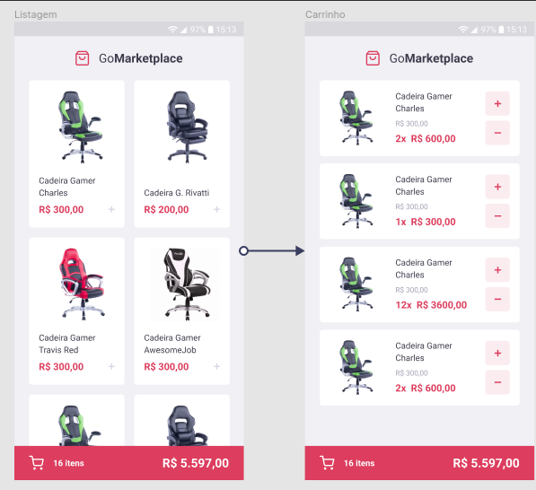

  

# GoMarketplace 🛍️
Este repositório é referente ao desafio 'Fundamentos do React Native' do Bootcamp GoStack 11.0, da Rocketseat 🚀.

# Proposta
Este projeto é um estudo dos conceitos de Contexto do React-Native, tendo como 'carro chefe' a Context API e seu hook (useContext).
A ideia é simular uma loja fictícia, trazendo dados de uma Fake API e integrar as informações disponíveis em tela, tais como quantidade de produtos e preço final.
O diferencial é o Tema Dark, que também foi construído utilizando a Context API do React.

  

# Tecnologias Utilizadas 🚀
React ⚛️  
React Native ⚛️  
React Navigation ⚛️  
Styled-Components 💅🻠 
React Icons ⚛️❤️  
Typescript 🦕
